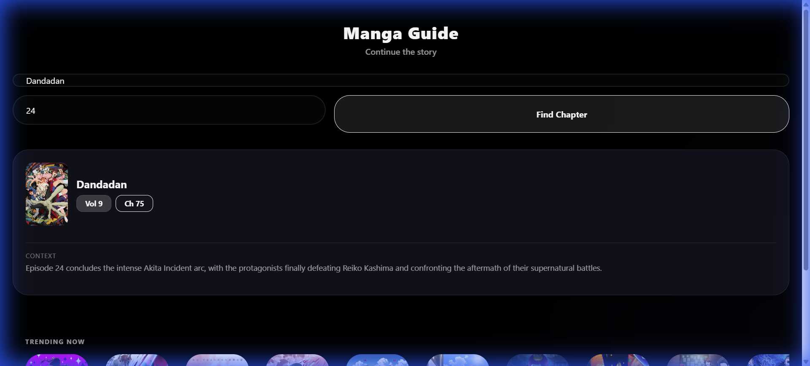
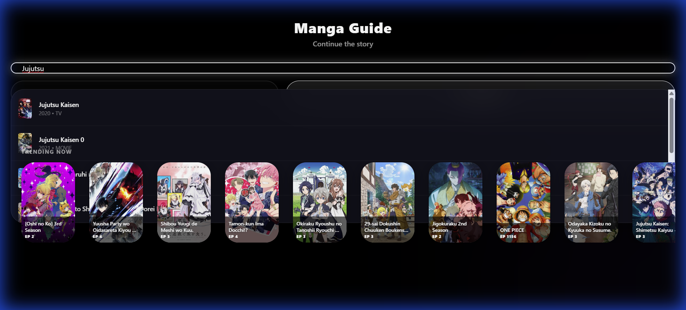

# 🌙 Luna's Manga Guide

> **"Continue the story"** - Discover exactly where your favorite anime leaves off in the manga.



A fast, beautiful, and intelligent tool powered by **Google Gemini 1.5 Pro**. Stop guessing chapter numbers; let AI analyze the context and finding the exact continuation point for you.

🔗 **Live Demo:** [manga-guide-native.vercel.app](https://manga-guide-native.vercel.app/)

---

## Features

- **Precision 100%**: Uses Google Gemini to analyze anime episodes and map them to manga chapters with context-aware accuracy (handles "Part 2", "Cour 2", films, etc.).
- **Smart Search**: Glassmorphic search bar with instant autocomplete and unified titles (no more "Season 3 Part 2" mess).
- **Apple TV Dark UI**: A premium, "Void Black" aesthetic with glassmorphism and smooth interactions.
- **Serverless AI**: Built on Vercel Serverless Functions for instant, scalable AI responses.
- **Date-Aware**: The AI knows "today's date", ensuring accurate info for currently airing shows (like *Dandadan* or *Blue Lock*).



## Stack


## Running Locally

1.  **Clone the repo**
    ```bash
    git clone https://github.com/arturokaadu/manga-guide-native.git
    cd manga-guide-native
    ```

2.  **Install dependencies**
    ```bash
    npm install
    ```

3.  **Setup Environment**
    Create a `.env` file (or hardcode for local dev) with your Google AI Studio Key:
    ```env
    GEMINI_API_KEY=your_api_key_here
    ```

4.  **Run the Local Proxy (for AI)**
    This project uses a local proxy during dev to bypass CORS and simulate the serverless environment.
    ```bash
    node local-proxy.js
    ```

5.  **Start the App**
    In a new terminal:
    ```bash
    npx expo start --web
    ```

6.  Open `http://localhost:8081` and enjoy! 🖤
